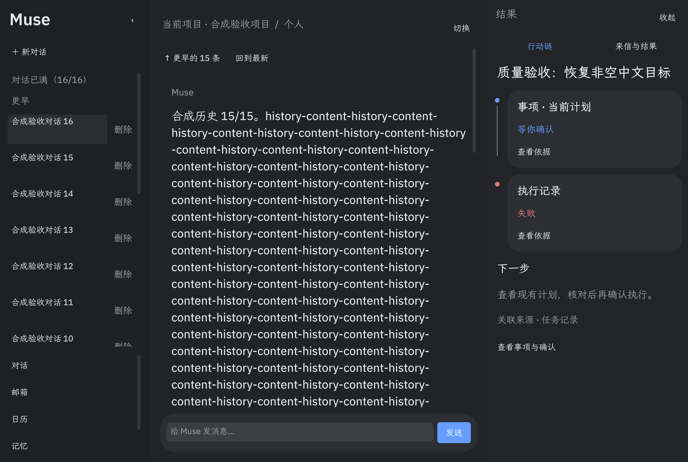
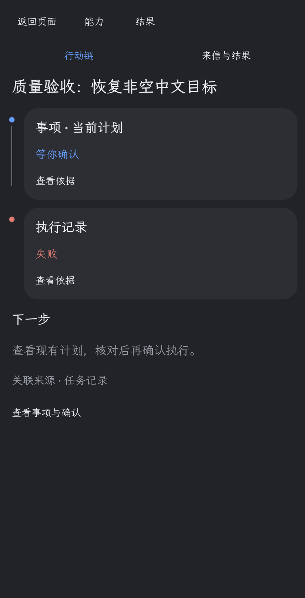
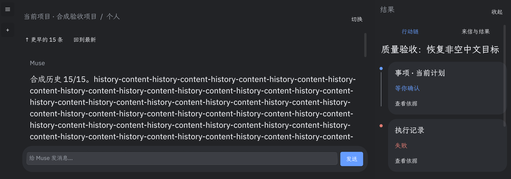

# Muse 行动链报告

## 当前状态

隔离 MVP-1 已实现并完成参考原生 UI 子集验证，MVP-2 部分完成；**未合入正式主线，官方新 Host 全链未验收**。来自 `codex/muse-action-chain-20261009` 的最终测试源码 SHA256：`380ebcf535b507ea58588d57493f6c76e4534c317b092f29fdd5584f84f4bace`。本轮关机中断后由 A 接管，B 已停写。

## 当前Commit与汇总位置

实现提交`266f9c66`，位于独立行动链分支；本A树仅汇总报告和合成证据，没有复制或合并主界面源码。下述源码及测试路径相对于行动链工作树；截图和结果副本在A树可直接查看。

## 文件与实现边界

- `official_muse/app/source/main.splash`：约247行只读投影、侧栏切换、纵向节点、展开依据。原有485个业务函数逐字相同。
- `official_muse/action_chain/tests/`：真实参考 Splash VM 状态检查、可见原生窗口导航/恢复检查。
- `official_muse/action_chain/evidence/`：结果、纠错记录、合成界面截图；完整原始日志与失败截图在 ignored build，有 SHA 清单。

复用当前会话关联的 Goal、来源邮件、日历链接和独立读回回执、动作历史、相关 Memory 引用、旧草稿失效及确认失效记录。未关联事项显示空状态；记录不可读则受阻。没有新执行协议、审批、轮询、模型调用或索引。默认有待处理来信时仍展示原提醒页，用户可选择行动链。

## 已验证

| 项目 | 结果与边界 |
|---|---|
| 9状态、受理不等于核验、旧历史保留 | 25/25 `FIXTURE_PASS`；合成数据、真实参考VM |
| 同事项后续信、旧AI稿失效、手写稿保留 | fixture通过；未冒充新宿主真实来信全链 |
| 项目、归属、账号隔离，记忆引用变化 | fixture通过，展示只读、未修改原数据 |
| 宽/窄/矮/再次重启 | 原生可见窗口1100×740、请求412×892、990×539、1200×420及再次1100×740，共5个启动；聊天输入可用、节点恢复、依据展开、原结果页切换通过。窄窗口实际屏幕高度限制，截图为实际尺寸；折叠左栏后输入宽231px |
| 恢复防重 | 既有goals.json内1条动作前后精确相同；初版检查器误比较不存在actions.json，原报告保留，独立读回纠错文件给出非空真实动作摘要，新检查器已修 |
| 核心Mail逻辑 | 同源码11项官方协议fixture通过，零外发。原生可信确认/投递不在本项验收范围 |
| 大量历史 | 10,000条动作，扫描上限64、节点上限12；10次投影累计约7.97ms（参考VM单次测量，不是整宿主性能提升） |

失败原样保留：初版嵌套 on_render 导致右栏空白；试验 Padding 类型不存在后改为已验证的 Inset；初版测试支架端口未就绪、空格严格匹配误判；大历史一次构造触及预算后改为分批构造 fixture，**未提高运行预算**。

## MVP 完成情况与剩余

MVP-1：标题、状态链、来源、下一步、现有渲染驱动更新、真实持久化状态恢复已实现。MVP-2：失效/冲突与节点依据已实现；多事项切换尚未实现。

当前 Muse 基础 UI 为深色，浅色主题真实窗口尚未验证，不声明浅色通过。历史节点按有限关键记录展示，完整业务历史保持。正式 rc18 / 新官方 Host 的20次启动及真实业务链未通过，因此仍隔离。

## 截图

## 60—90秒演示方案

1. 0—15秒：明确标注合成验收事项，在当前会话打开行动链，展示来源与计划。
2. 15—35秒：收到后续同事项信息，保留旧已核验历史、显示旧回复草稿失效（须真实业务数据准备后录制）。
3. 35—50秒：展开依据，查看记忆引用变化或日历冲突，说明候选方案仍待确认。
4. 50—70秒：进入已有官方受控确认入口；缺能力时演示真实受阻，不能剪成执行成功。
5. 70—90秒：重新启动，展示已保存历史和待核验记录恢复，核对没有重发。

这是一份演示方案，**未制作或宣称完成真实新Host业务视频**。在正式原生与核心回归通过后才合入。
