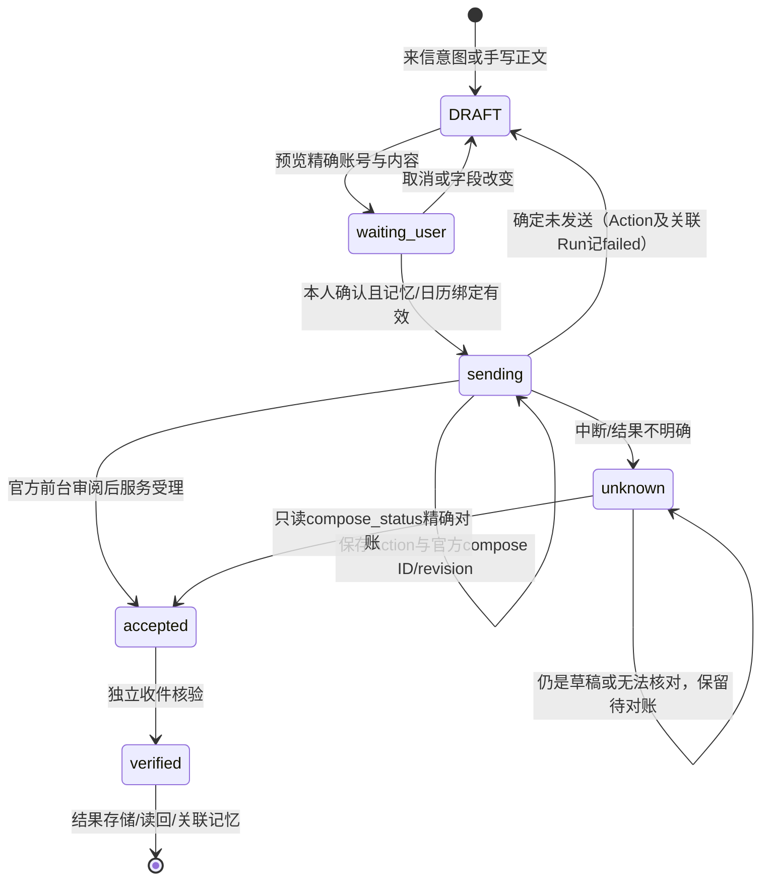
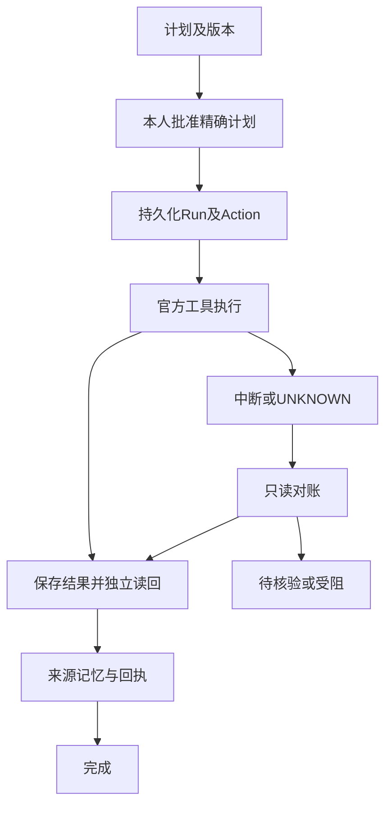
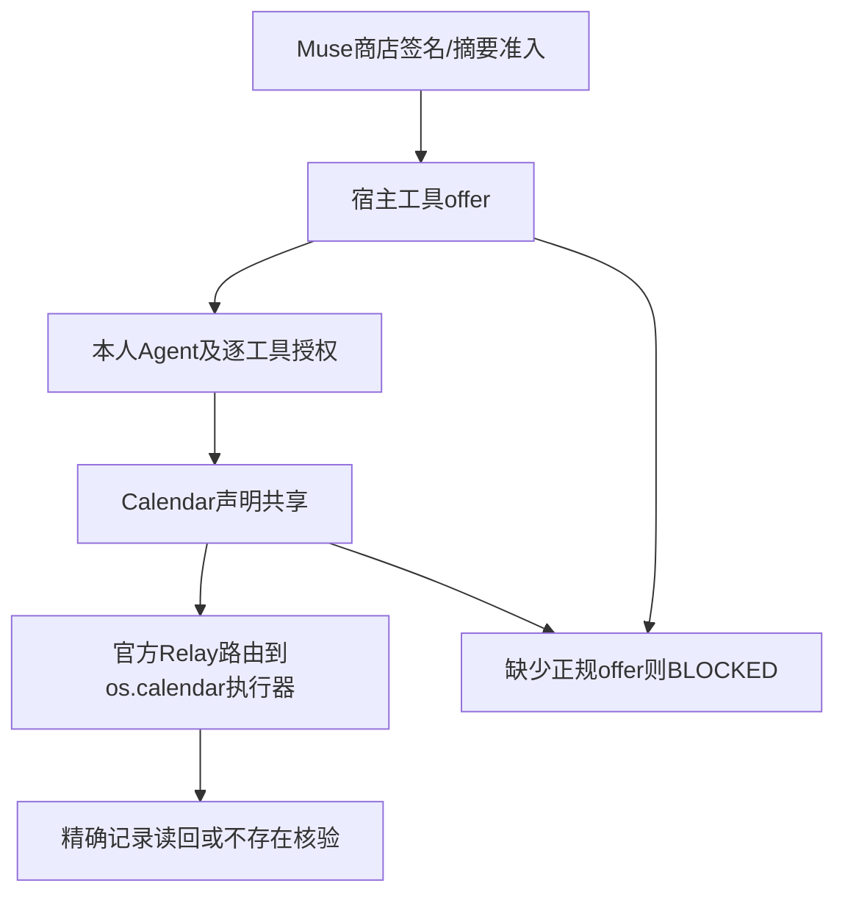

# Muse 当前执行状态机

核对对象：`official_muse/app/source/main.splash`，可读源 SHA256 `34798c97c003d0eb1f0a0d65e470f0d29c50413cc385cf3f7b2cc96aeebbdba6`。这是现有实现的说明，不是新增运行时或完成声明。长期目标产品入口没有恢复。

## 邮件：批准与外部事实分开

入口：`mail_send_confirmed`。账号、收件人、主题、正文及回复头与预览绑定；旧意图、相关记忆及关联日程改变会使旧批准失效。`mail_send_step` 每个默认预算回调保存一个阶段；持久化动作后才进入官方 `mail.compose`、`mail.review_send`。`mail_review_current` 在每次回调重新核对绑定。宿主返回受理只进入 `accepted`；`mail_verify_received` 才记录收件事实。取消不会覆盖手写正文。

`sending`/`unknown` 在恢复时只查询已持久化的官方草稿身份，不重新调用发送。缺 compose ID、账号/版本/正文不一致、宿主错误均保持待对账。19项协议与7种独立VM恢复是合成测试；当前最新宿主真实前台审阅/SMTP/收件尚未完成。

## 一次性任务与恢复

`boot` 先挂载控件；`boot_load` 分阶段恢复会话/活动/记忆/Goal/日历关联。`boot_restore` 保留中断动作，日历任务不会仅凭本地结果文件从running转completed。旧周期任务只是历史记录，不恢复周期执行。

## 内置 Calendar 与正式准入

当前 `calendar_enabled` 返回false，`muse_calendar_request` 明确拒绝；历史关联与回执仍保留。内置Calendar原版及隔离补丁的CRUD/恢复/UI已验证，但正式Muse Relay与共享更新/删除未获准，不将其画成成功。补丁仅供官方审阅。

## 行动链：只读投影

现有事务、Run、Action、来源、记忆检索及Calendar回执 → `ac_projection` → 当前状态/节点/依据/下一步。无新轮询、模型调用或执行权限。历史verified保留；accepted/UNKNOWN没有独立结果只能显示待核验。旧草稿或批准失效、冲突、权限缺失分别显示，不用UI状态替代执行证据。

节点详情与事项切换仅在当前聊天及授权的项目/归属/账号范围内；最多展示12节点、8个事项，完整历史不删除。重启从现有持久化状态重新投影，偏好通过现有 `ui-layout.json` 恢复。
