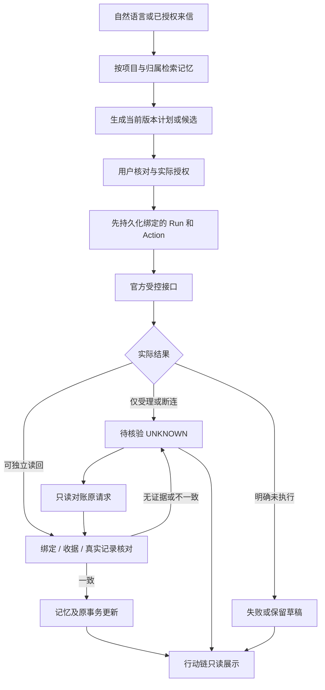

# Muse 状态与执行边界

NIGHT-002，依据当前开发源2253e9f0。这是现有状态的说明，不增加业务状态机、执行入口或新Runtime。

## 一次性任务

`make_plan`保存后异步通过`goal_open_saved_plan`绑定原对话；不能先完成Run再把尚未绑定的计划当成当前对话资料。`core_start_run`核对Goal ID/当前版本/planned及一次性任务范围；`core_finish_run`要求Run/Goal版本及运行状态一致，completed的产物路径、独立读回task_id也必须相同。

## 邮件

`DRAFT → waiting_user → sending → accepted / unknown`，明确未提交时回到草稿并关闭仅该绑定Run。应用确认绑定精确正文、账号、事项与版本；真正发送继续经过官方`mail.compose → mail.review_send → mail.compose_status`。原生审阅需要本人可信动作，模型文字或聊天批准不能代替。

- `accepted`：服务受理，未证明收件；本人收件核对或受支持的独立核验才可推进。
- `unknown`：原compose_id/revision/精确内容只读核对，禁止盲目重发；待核对归档也不能解锁相同payload的重复发送。
- 草稿意图、记忆引用或关联日程变化：原确认/旧方案失效，保持手写内容，重新确认当前内容。
- 重启恢复`sending`为`unknown`，沿原ID对账，不自动执行第二次。

实现入口：`mail_review_current`、`mail_compose_before_review`、`mail_review_host`、`mail_check_host_status`、`mail_send_receipt_step`、`mail_keep_pending_step`及原恢复逻辑。

## Calendar

正式目标为官方内置`os.calendar`，由合法caller、声明的tool grant、owner/shareable、双方准入、本人consent与既有审批共同约束。当前开发源`calendar_enabled`及`muse_calendar_request`明确阻塞未接通Relay；历史`calendar.*`只保留原日志语义，不偷偷回到EventKit或冒用os.calendar。

列表和写入回执不能证明精确读回或删除后不存在。原ID/冻结字段/独立真实记录须匹配；UNKNOWN先只读对账。原版缺少精确get及跨owner改删的事实，与配套Calendar提案的组件通过分开记录。独立Native只读原型不等正式Muse已获写权限。

## Memory与共享DSL

持久文档`muse.dsl/1`和原计划`muse.goal/0.1`保留既有校验/版本；新增`muse.view/1`只提供已筛选资料的展示和上下文。更正保留来源/历史，遗忘保留墓碑、排除上下文和无效引用；冲突保留并询问。新对话只是注意力焦点，检索仍受user/project/owner/account授权和有效期限制，不能整库注入。

## 行动链的只读投影

| 既有输入状态 | 当前中文显示 |
| --- | --- |
| verified | 已核验 |
| running / in_flight / sending | 进行中 |
| planned / waiting_user / prepared | 等你确认 |
| blocked / paused / unavailable | 受阻 |
| conflict | 冲突 |
| stale / superseded | 已失效 |
| failed / error | 失败 |
| accepted / unknown / completed | 待核验 |
| new / DRAFT / candidate / editing / idle | 未执行 |

以上来自`ac_state`；单独completed不会在行动链被自动涂成成功。`ac_projection`重查当前scope及真实记录，最多12节点，保留历史/后续变化/旧草稿失效。DSL声明read_only与无工具权，不是安全凭据。UI只进入原受控流程，没有自己的审批、重发、日历写入或第二套业务账本。
