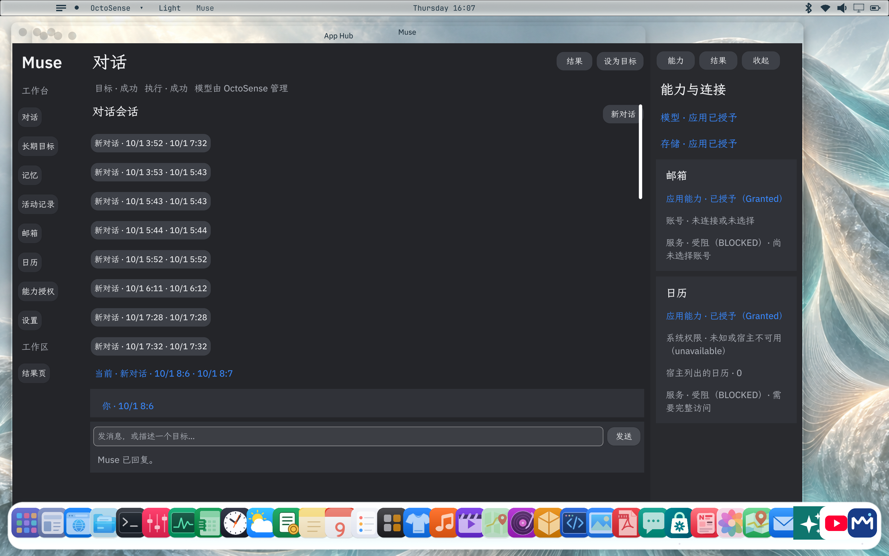

# Muse · GOSIM Agentic App 2026

Muse 将中文对话、长期目标、来源记忆与真实软件动作放在同一个工作台。用户可以查看计划，分别批准日历创建和邮件发送，并核对动作结果及来源。

本仓库保存参赛项目的完整当前源码：桌面版 Muse、官方 OctoScript/Splash 应用、实际使用的隔离 OctoSense/App Hub 宿主，以及对应 Makepad/OctoScript 源码。源码基线为 **Muse 官方候选0.2.8**；实际验收状态是 **PARTIAL**，未声称官方宿主扩展已经获上游准入。



## 代码结构

| 路径 | 内容 |
| --- | --- |
| app/ | 桌面版Python/Objective-C代码，Goal/Memory/Capability DSL、连接器与单元测试 |
| scripts/、miniapp/、patches/ | 构建、安装、模型启动、UI与集成测试及历史源码补丁 |
| official_muse/app/bundle/ | 官方Splash应用源码、manifest、资源与listing |
| official_muse/phase2/ | 官方版状态逻辑、真实UI测试与可审阅宿主补丁 |
| vendor/octosense/ | 本机实际构建使用的完整隔离宿主源码，含EventKit日历服务和原生模型历史修复 |
| vendor/app-hub/ | 带明确Calendar准入的本地App Hub源码 |
| vendor/makepad/ | 对应框架完整源码，含本机Splash入口与Metal回调补丁 |
| vendor/octoscript-makepad/、vendor/octoscript/ | 锁定的脚本运行时与语言源码 |
| evidence/phase2-live/ | 当前候选的合成实机测试、真实窗口截图与哈希记录 |
| SOURCE_MANIFEST.json | 源码来源、精确文件哈希和版本信息 |

Git仓库不存运行账户、私钥、生产数据库、模型权重、编译输出或安装包。已有源码中的安全测试fixture不代表真实凭据。上游资源与许可证在各vendor目录保留，见 [第三方来源](THIRD_PARTY_NOTICES.md)。

## 已实际验证

- 官方OctoSense / App Hub真实容器中的中文八页、三栏布局与响应式输入区。
- 三个新Goal各一个Run，真实model.complete建议、用户批准、隔离存储和独立读回。
- 最终打包Shell正常重启，23个状态与结果文件哈希不变，没有新增Run或外部动作。
- 系统日历Full Access下的查询、创建、修改、删除；每一步独立get读回；合成测试事件已清理。
- 五种实际可达窗口尺寸下点击发送并收到真实模型回复。
- 带来源记忆的更正、置顶和遗忘墓碑；真实Activity事件及归属核对。

## 当前验收差异

小模型多轮语义复测2/3，仍不稳定。真实Mail登录、读取、确认发送、收件端核验，以及邮件→日历同Goal链仍待完成；Memory来源内容hash和部分设置/视觉也有差异。Calendar及框架补丁是本地候选，上游尚未接受。详细结果见 [实测报告](PHASE2_LIVE_TEST_REPORT.md)、[验收矩阵](PHASE2_LIVE_ACCEPTANCE.md)。

## 构建与运行

macOS本机构建需要Rust工具链与Apple Command Line Tools。Rust外部依赖按Cargo.lock获取；本仓库不内置模型权重。vendor/octosense/.sources使用仓库内部相对链接连接已交付框架和App Hub源码。

```sh
cd vendor/octosense
cargo build --locked --release -p octosense --no-default-features --features app-hub
python3 tools/package_calendar_candidate.py --release --output ../../build/Muse-OctoSense.app
```

App Hub / card-host：

```sh
cd vendor/app-hub
cargo build --locked -p octosense-app-hub --bin hub
cargo build --locked -p octosense-card-host --bin card-host
cd ../..
./vendor/app-hub/target/debug/hub check official_muse/app/bundle --allow-unsigned
```

`--allow-unsigned`仅为源码开发检查。真实安装仍须使用经过Gate和签名核对的App Hub catalog；不能使用dev-grant-all绕过准入。打包脚本使用本地ad hoc签名，必须在运行时使用新的OCTOSENSE_HOME/OCTOSENSE_APP_DATA；它不是正式签名发布。

原归档没有Git对象，vendor快照可以审查/构建，但不能声称tools/setup.py的Git provenance检查通过。宿主补丁应用顺序、锁定文件与历史构建证据见 [宿主补丁说明](official_muse/phase2/host_extension/README.md)。模型由官方宿主profile配置；测试使用无Key的本机Qwen服务。凭据只输入官方Host面板，日历操作与邮件发送各自单独确认。

桌面版入口见 [本地运行说明](README_LOCAL_AGENT.md)。源码构建与实机测试脚本均在仓库中；不要直接在签名安装包里跑可能生成pyc的测试。

## 下一阶段

仓库创建后继续同一应用的Phase2收口与全量回归，冻结0.2.9候选。禁止用旧版证据冒充新候选通过；在全部Definition of Done达到前保持PARTIAL。主办方issue提交须在用户确认后进行。
