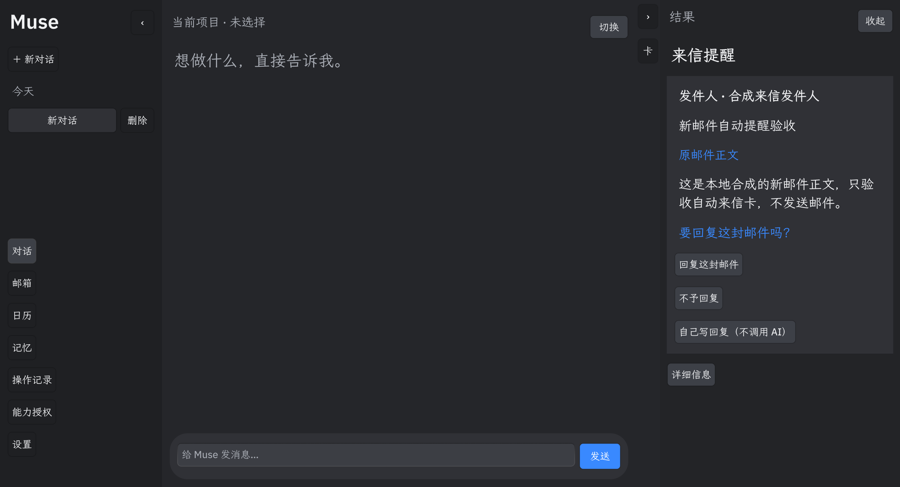

# Muse · 星海队

## 1. 把对话变成可核对的行动

Muse 在 OctoSense 官方容器中提供中文 AI 对话、来信结果卡、邮件起草与确认发送、系统日历安排与改期，以及带来源、跨对话检索的全局记忆。

- 左侧：可折叠聊天历史与邮箱、日历、记忆等快捷入口。
- 中间：当前讨论和输入；新对话沿用授权范围内的相关全局记忆。
- 右侧：来信提醒、有效结果和具体动作确认，技术详情默认收起。

**当前开发候选：0.3.26-rc9；验收PARTIAL（5 PASS / 14 PARTIAL / 1 BLOCKED）。** 公开稳定基线0.3.25保留。rc9真实模型跨聊天记忆更正/遗忘、一次性任务首次恢复、两个模型受影响日历追问已验证。70启动及额外100重开通过，两小时第二轮进行；Calendar桥源码已修但未进入运行Host，双模型原20题/2准备/6变体与同候选外部链仍缺。最新入口是[晨间报告](MORNING_CHAMPIONSHIP_REPORT.md)和[二十项矩阵](RC_ACCEPTANCE_MATRIX.md)。不把旧运行包当成最新版。



*0.3.13真实可见card-host中的合成邮箱截图，仅展示交互；不冒充当前版本真实邮件验收。*

## 2. 官方源码与依赖

官方应用使用 **OctoScript / Splash / Makepad**，入口是[main.splash](official_muse/app/bundle/main.splash)，提交目录为`official_muse/app/bundle/`。可读源码位于`official_muse/app/source/main.splash`；Python为测试和构建工具，Rust为官方宿主配套扩展。

| 路径 | 用途 |
| --- | --- |
| `official_muse/app/bundle/` | 0.3.26-rc9 compact payload、manifest、listing和资源；source4c970e04对应rc9实机候选，listing截图仍为有身份记录的V12支持材料 |
| `official_muse/global_memory.splash`、`incoming_mail.splash`、`scheduling.splash` | 全局记忆、逐封来信和安排/改期模块 |
| `dependencies.lock.json` | 五个官方SDK的固定commit、完整差异和重建树哈希 |
| `sdk-overlays/` | 可直接阅读的本地宿主/框架/准入修改，完整保留已有修复 |
| `scripts/bootstrap_sdk.py` | 从官方锁定来源恢复依赖，逐文件/模式/链接验证，不接受不匹配的树 |
| `patches/muse-source-cleanup-20261004.patch` | 历史主入口清理补丁；已集成0.3.25，保留为来源记录 |
| `official_muse/prelim/`、`ui_memory/`、`round2/`、`phase2/` | 测试、公开证据和历史失败记录 |
| `app/`、`scripts/`、`miniapp/`、`MUSE_HANDOFF/` | 保留的桌面历史源码、工具和交接 |

官方基础源码按锁定版本下载；本地Calendar、准入、模型和框架扩展可重建，但尚未声称获官方上游接受。许可见[THIRD_PARTY_NOTICES.md](THIRD_PARTY_NOTICES.md)，瘦身说明见[sdk-overlays/README.md](sdk-overlays/README.md)。

## 3. 构建和检查

环境：macOS、Rust、Apple Command Line Tools、Python 3。首次准备需要访问官方GitHub及Cargo依赖；无需输入私人密钥。

```sh
python3 scripts/bootstrap_sdk.py
python3 scripts/bootstrap_sdk.py --verify
cd vendor/octosense
cargo build --locked --release -p octosense --bin octosense --no-default-features --features app-hub
python3 tools/package_calendar_candidate.py --release --output ../../build/Muse-OctoSense.app
cd ../app-hub
cargo build --locked -p octosense-app-hub --bin hub
cargo build --locked -p octosense-card-host --bin card-host
cd ../..
./vendor/app-hub/target/debug/hub check official_muse/app/bundle --allow-unsigned \
  --publisher-key muse-local-rehearsal=bb05ce91333a0045f9f8187eba865f11d9e14ec636aeaee80144708984e740c5
```

四个内部`.sources/`链接由bootstrap恢复。已有vendor时脚本只核验，发现差异立即停止，保留本地修改。开发公钥不是发布私钥；开发check不代替Gate、正式发布身份、catalog、能力授权及人工审查。模型和邮箱/日历账号在官方Host设置中配置。

历史清理补丁已集成，不向当前源码重复应用。改动可读入口后，须重新生成compact bundle、stamp/签名并核验。最新SDK锁da756dde包含Calendar布尔修复；当前可复用Intel暖Host938来自旧SDK3f，不能宣称已集成新修复。完整clean build因空间不足受控中止，记录在[源码及运行交付边界](SOURCE_DELIVERY.md)。完整运行资料不放在源码仓库。

## 4. 验收、支持与隐私

- [晨间报告](MORNING_CHAMPIONSHIP_REPORT.md)、[原二十项判定](RC_ACCEPTANCE_MATRIX.md)、[日历实际诊断](RC_CALENDAR_READONLY_REPORT.md)与[真实模型和邮箱证据](RC_FINAL_LIVE_REPORT.md)
- [历史日历修复报告](MUSE_CALENDAR_REPAIR_REPORT.md)、[历史判定](ROUND_ACCEPTANCE.md)与[历史三小时报告](THREE_HOUR_FINAL_REPORT.md)
- [源码清理报告](MUSE_CODE_CLEANUP_REPORT.md)、[SDK瘦身记录](SDK_SLIMMING_REPORT.md)和[历史截图归档](EVIDENCE_ARCHIVE.md)
- [来源和交付边界](SOURCE_DELIVERY.md)与[SOURCE_MANIFEST.json](SOURCE_MANIFEST.json)
- [问题反馈](https://github.com/9tuore/muse-agent/issues)

仓库不包含凭据、私人邮件、生产数据库、私人实机资料、模型权重、构建缓存或安装包。最新两张原生截图使用隔离合成资料，并记录source/Host身份。保留唯一失败证据、旧Git历史和公开Tag。正式隐私政策地址与publisher材料尚待核实，未正式提交App Hub。本轮仅本地小步提交，原20项及关键门槛未全过前不同步公开main或创建成功Tag。
