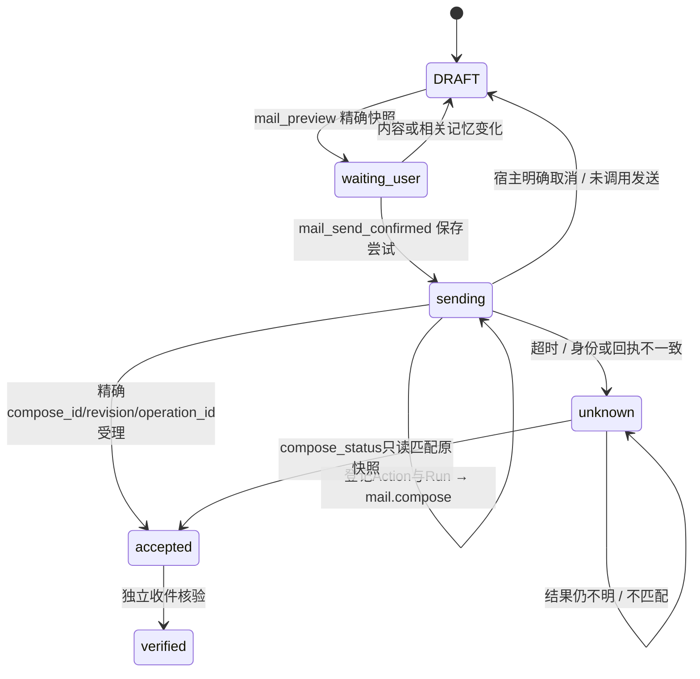
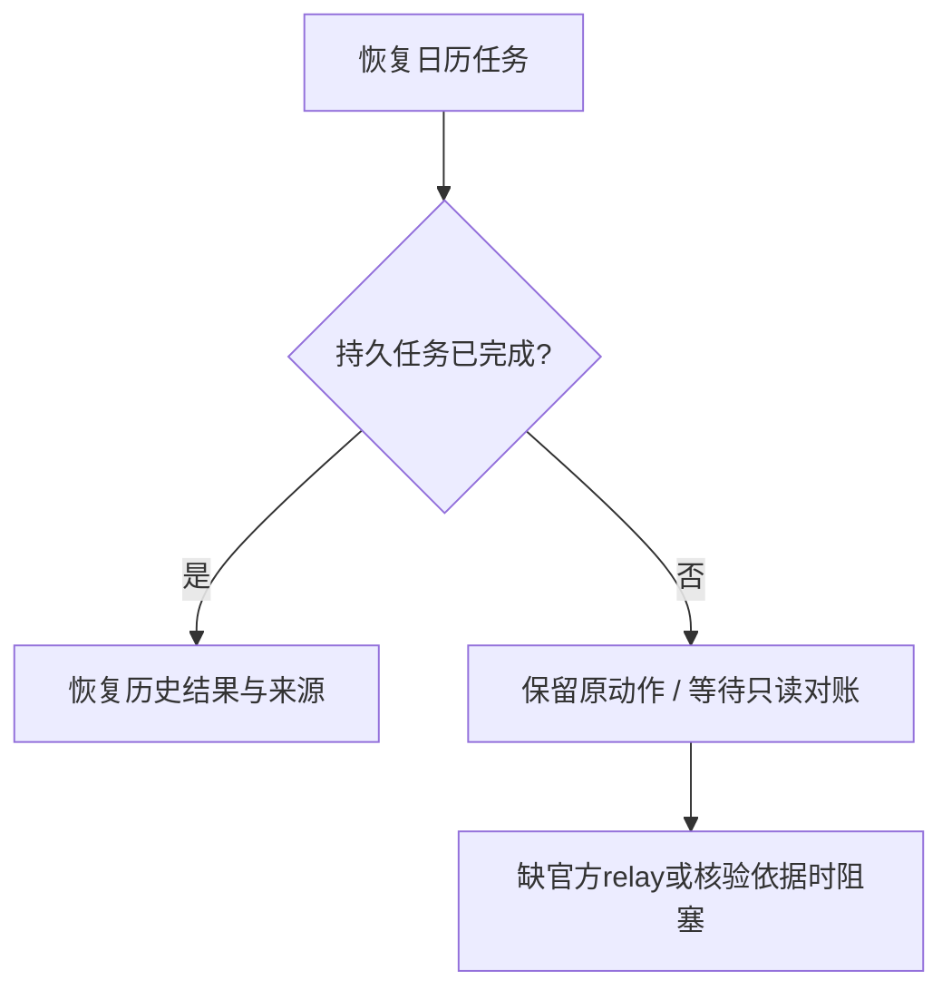

# Muse 执行与恢复状态机

适用范围：A的rc18研究源，正式根bundle仍为rc17。本页描述实际函数和持久化边界，方便审查单文件；不是新业务系统。

## 邮件

`mail_send_step`先登记动作和关联Run；`mail_compose_before_review`保存宿主生成的compose_id/revision后才打开`mail_review_host`。`mail_send_receipt_step`保存本地状态并结算Action。明确未发送时，只关闭该请求绑定的Run；未知结果保留，不自动重发。`mail_verify_received`不由SMTP受理自动触发。

`mail_payload_pending`保留相同载荷的in_flight/unknown/accepted防重复。手写正文仍在原草稿；宿主原生确认不能由应用自行批准。历史Action中的`service=mail.send`是旧数据标签，不是rc18调用旧发送接口。

## 日历

当前默认目标是官方内置`os.calendar`。普通Muse不能冒用其身份直接调用系统服务。共享查询/创建须经正式App-Agent relay；改期/删除的owner-only策略及精确读回缺口等待维护者审阅。

当前`calendar_enabled`为false，相关入口真实显示能力缺失。`boot_restore`、`chat_restore_goal_view`和`calendar_select_link`只恢复已完成日历任务的结果；运行中任务即使有本地产物也不晋升完成。文件保留用于后续只读对账，不再次写入现实系统。

## 记忆与行动链

Memory DSL通过现有官方jailed文件保存。检索先检查项目/归属/账号授权，再按当前注意力焦点排序；deleted和冲突状态保留含义。新Chat继承焦点，不复制全部记忆进模型上下文。

行动链隔离版本读取现有Goal/Run/Action/Receipt/Activity/邮件关联，只做状态投影。它不发送邮件、不修改日历、不增加审批权；没有独立读回时不显示已核验。当前尚未合入A。

## 证据索引

- `official_muse/semifinal/evidence/mail-linked-cancel-before.json` 与 `mail-linked-cancel-after.json`
- `official_muse/semifinal/evidence/calendar-restore-before.json` 与 `calendar-restore-after.json`
- `official_muse/semifinal/evidence/runtime-major-before.json` 与 `runtime-major-after.json`
- 完整身份、范围及缺项：`MUSE_OVERNIGHT_20261010_REPORT.md`
