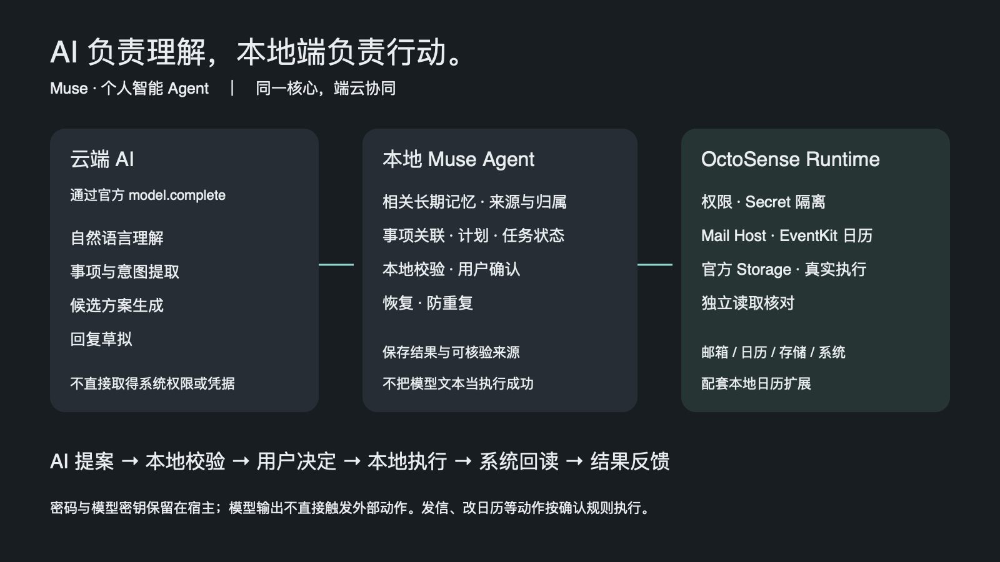

# AI 负责理解，本地端负责行动

| 层 | 职责 | 当前实现位置 |
| --- | --- | --- |
| 云端模型 | 理解、语义提取、候选生成、草拟回复 | 通过宿主 `model.complete`；已实测 MiniMax-M3 |
| Muse Agent | 全局记忆、相关检索、事项关联、计划、确认、状态、恢复与防重复 | `official_muse/app/source/main.splash`、`global_memory.splash`、`incoming_mail.splash`、`scheduling.splash` |
| OctoSense Agent Runtime | 模型代理、权限、Mail Host、EventKit Calendar Extension、Storage、Secret 隔离 | 固定 SDK 与 `sdk-overlays/` |
| 系统与服务 | 邮件同步及发送、系统日历、存储与独立读回 | Mail Host / EventKit / 官方 Storage 接口 |

执行路径：**AI 提案 → 本地校验 → 用户决定 → 本地执行 → 系统回读 → 结果反馈**。

模型生成候选，不直接取得系统权限或邮箱凭据。Muse 使用授权范围内的相关记忆，不整库塞入上下文。发信、日历修改与删除保留确认；读取结果与恢复路径不能由一句“完成了”替代。

日历是配套 EventKit 宿主扩展。锁定原版 App Hub 对 `calendar` capability 的准入仍拒绝，本地扩展验证不能表述为上游正式接受或已经上架。
