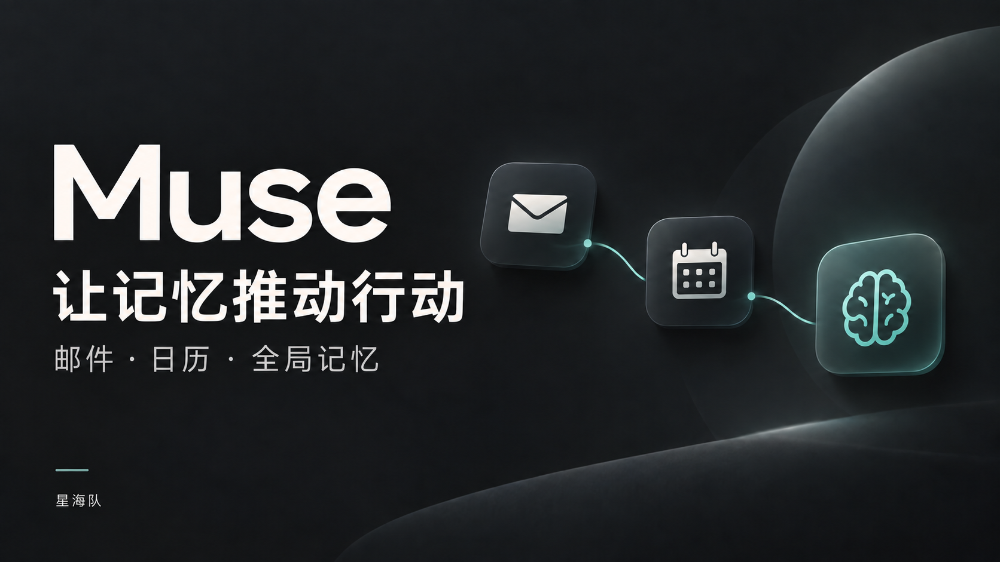

## 当前交付：0.3.27-rc10

窄范围授权的新约定可自动安排，改期和发信仍单独确认。[本轮实测与缺项](FINAL_REPORT.md)。完整状态PARTIAL；App Hub审核状态以提交issue为准。

# Muse · 个人智能 Agent

**会记住你，并帮你把事情办下去的个人 AI Agent。**

AI 负责理解，本地端负责行动。

## 它解决什么问题

重要信息散落在邮件、对话和日历里。Muse 把来信与相关记忆联系起来，检查真实日历，提出可确认方案，并在你确认后执行、核对结果，继续处理后续改期。

**来信 → 相关记忆 → 日历候选 → 用户确认 → 真实行动 → 结果核验**

## 先体验

1. 解压 `Muse-Tmall-Submission.zip`。
2. 双击 **Muse.app**（也可用 RUN_MUSE.command）。离线模型会自动启动并配置；首次在应用中心确认安装并打开 Muse，以后直接进入 Muse。
3. 基础聊天无需 API Key 或联网下载。需要真实邮件、日历时，再在 Muse 连接自己的邮箱并授权日历；复杂任务可在官方模型设置切换更强模型。

运行包面向 **Intel Mac / macOS 14+**，使用配套的 OctoSense Agent Runtime。详细步骤见 [运行指南](RUN_GUIDE.md)。内置 Qwen2.5-0.5B Instruct Q4_0 基础离线模型和 Intel 推理组件；已有用户模型配置会保留。首次账号与系统授权的时间不计入已测启动时间。

[完整使用教程（QQ 授权码、邮箱、日历、模型与常见问题）](使用教程.md)

## 看作品

- [产品演示与拍摄状态](demo/README.md)：中文配音的产品流程讲解，以及 rc9→rc10 邮件联动日历实测回放。
- [作品介绍](PROJECT_INTRO.md) · [AI 实践](AI_PRACTICE.md) · [端云架构](ARCHITECTURE.md)
- [真实截图清单](assets/screenshots/README.md) · [三分钟实机拍摄脚本](TMALL_DEMO_SCRIPT.md)
- [技术栈](TECH_STACK.md) · [已知限制](KNOWN_LIMITATIONS.md) · [源码身份](source/SOURCE_MANIFEST.md)

星海队 · 团队 ID 561194752707317763。源码与支持入口：[GitHub](https://github.com/9tuore/muse-agent)、[Issues](https://github.com/9tuore/muse-agent/issues)。

本交付状态 **PARTIAL**。同一核心为 `0.3.26-rc51`；完整同版本邮件→日历→改期→回复实录和六张最终截图尚未齐全。讲解画面、真实节选与验收证据分别标明来源。
